# Dokumen Teknis Modul 1 — Lingkungan Pengembangan, Git, dan Lalu Lintas HTTP

**Nama/NIM**   : Alwisyah Putra / 105224052

**Repositori** : https://github.com/alsptr06/PEMWEB-MODUL-1

---

## 1. Lingkungan Pengembangan

Praktikum ini menggunakan sistem operasi **Windows** dengan **PowerShell** sebagai antarmuka baris perintah. Tabel berikut merangkum versi seluruh perangkat lunak yang dipergunakan dan diverifikasi sebelum praktikum dimulai:

| Komponen | Versi yang Terpasang | Cara Verifikasi | Fungsi dalam Praktikum |
|:---|:---|:---|:---|
| Sistem Operasi | Microsoft Windows (PowerShell 5.x) | `Get-Host` pada PowerShell | Lingkungan kerja utama |
| Node.js | v24.21.0 (LTS) | `node -v` | *Runtime* JavaScript di sisi server |
| npm | 11.19.0 | `npm -v` | Manajer paket untuk dependensi Next.js |
| Git | 2.52.0.windows.1 | `git --version` | Sistem kontrol versi terdistribusi |
| Visual Studio Code | Terpasang (dikonfigurasi sebagai `core.editor` Git) | `git config --global --list` | Editor kode & penyelesaian konflik |

Konfigurasi global Git (`git config --global --list`) menunjukkan identitas `user.name=Alwisyah Putra` dan `user.email=alwisyah61@gmail.com` yang wajib tercatat karena Git menautkan identitas ini pada setiap *commit*.

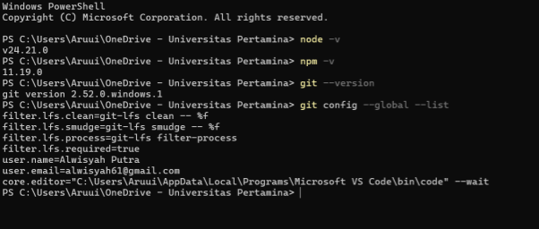

*Gambar 1: Hasil verifikasi `node -v`, `npm -v`, `git --version`, dan `git config --global --list`.*

Proyek Next.js dibuat dengan perintah `npx create-next-app@latest` (nama proyek: `modul-1`, seluruh opsi dibiarkan pada nilai *default*). Proses ini menginstal `next`, `react`, `react-dom`, Tailwind CSS, TypeScript, dan ESLint, sekaligus **menginisialisasi repositori Git secara otomatis**. Muncul peringatan `npm warn deprecated eslint@9.39.5` serta pemberitahuan `found 0 vulnerabilities`.

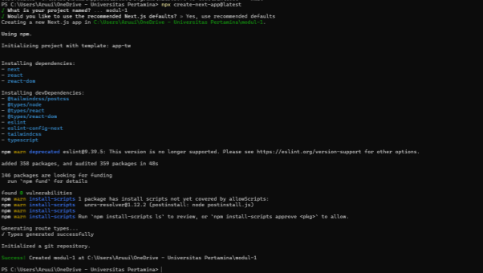

*Gambar 2: Keluaran pembuatan proyek Next.js; terlihat instalasi dependensi dan inisialisasi repositori Git.*

Server pengembangan dijalankan dengan `npm run dev` dan diakses pada `http://localhost:3000`. Halaman *default* Next.js tampil dengan teks *"To get started, edit the `page.tsx` file"*, yang membuktikan *App Router* berfungsi dan *live reload* aktif — setiap perubahan pada `app/page.tsx` langsung terlihat di peramban tanpa muat ulang manual.

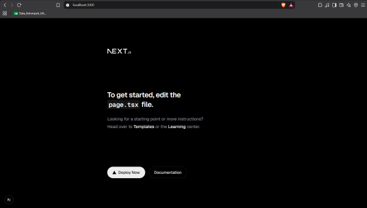

*Gambar 3: Halaman awal Next.js pada server pengembangan lokal.*

---

## 2. Alur Kerja Git

### 2.1 Pencatatan Perubahan (Staging & Commit)

Berkas `README.md` dimodifikasi (nama produk, deskripsi, cara menjalankan) dan dibuat pula `.env.local` berisi variabel rahasia untuk membuktikan bahwa `.gitignore` bawaan Next.js mengabaikannya. Alur kerjanya: `git status` → `git add .` → `git commit`. Peringatan `LF will be replaced by CRLF` bersifat informatif — Windows memakai akhir baris CRLF sedangkan Git menyimpan LF, dan Git menormalkannya otomatis.

- **Commit pertama:** `docs: tambahkan deskripsi produk pada README` → `[master fc6ebe]`, 2 berkas, 32 sisipan(+), 36 hapusan(-).
- **Commit kedua:** `docs: perubahan pada page web` (modifikasi `app/page.tsx` dan `app/layout.tsx`) → `[master 6cf295c]`.

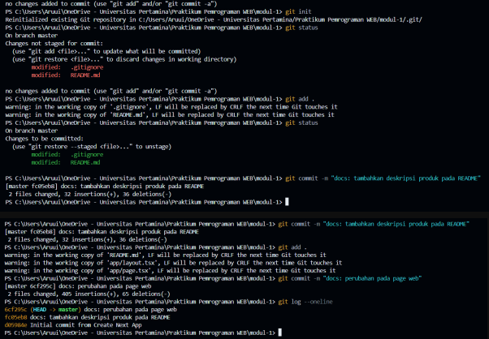

*Gambar 4: Tangkapan layar PowerShell: `git status`, `git add`, kedua commit, dan `git log --oneline`.*

Riwayat *commit* linier yang terbentuk:

```
6cf295c (HEAD -> master) docs: perubahan pada page web
fc6ebe  docs: tambahkan deskripsi produk pada README
de5984  Initial commit from Create Next App
```

### 2.2 Branch, Merge, dan Penyelesaian Konflik

Simulasi konflik dilakukan dengan skenario:

1. `git switch -c latihan/konflik` → mengubah satu kalimat di `README.md` → commit `docs: perjelas deskripsi produk`.
2. Kembali ke utama dengan `git switch master` → **baris yang sama** diubah dengan isi berbeda → commit `docs: ubah deskripsi produk`.
3. `git merge latihan/konflik` → Git menolak *merge* otomatis: `CONFLICT (content): Merge conflict in README.md`.

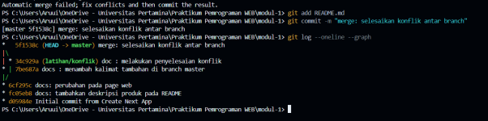

*Gambar 5: Terminal saat `git switch`, pembuatan *branch*, dan `git merge` yang menghasilkan konflik.*

Isi berkas saat konflik:

```markdown
<<<<<<< HEAD
"KALIMAT INI ADALAH KALIMAT YANG ADA DI BRANCH MAIN/MASTER"
=======
"Kalimat ini merupakan bahan untuk mencari penyelesaian konflik antar branch"
>>>>>>> latihan/konflik
```

**Cara penyelesaian:** ketiga penanda (`<<<<<<<`, `=======`, `>>>>>>>`) dihapus di VS Code menggunakan bantuan tombol *Accept Current Change / Incoming Change / Both Changes* pada *Source Control*, kemudian `git add README.md` dan `git commit -m "docs: selesaikan konflik antar branch"`.

**Alasan pemilihan isi akhir:** dipilih kalimat versi `latihan/konflik` ("*Kalimat ini merupakan bahan untuk mencari penyelesaian konflik antar branch*") karena kalimat tersebut lebih jelas menjelaskan konteks praktikum dan lebih sesuai sebagai deskripsi produk dibandingkan kalimat temporer versi `master` yang menandai posisi branch saja.

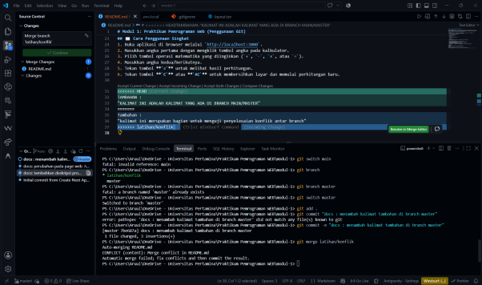

*Gambar 6: Penyelesaian konflik melalui *merge editor* VS Code.*

Grafik riwayat setelah penyelesaian konflik (perintah `git log --oneline --graph`) menunjukkan dua garis riwayat dari `master` dan `latihan/konflik` menyatu kembali pada *merge commit*.

### 2.3 Repositori GitHub dan Pull Request

Repositori **privat** `PEMWEB-MODUL-1` dibuat di GitHub tanpa README/lisensi, lalu dihubungkan dan diunggah:

```powershell
git remote add origin https://github.com/alsptr06/PEMWEB-MODUL-1.git
git push -u origin master
```

Opsi `-u` membuat Git mengingat hubungan *upstream* `master` ↔ `origin/master`. Autentikasi dilakukan melalui Git Credential Manager.

Selanjutnya dibuat *branch* fitur, dilengkapi bagian Teknologi & Cara Menjalankan pada `README.md`, lalu diunggah:

```powershell
git switch -c docs/readme-lengkap
git commit -m "docs: lengkapi README"
git push origin docs/readme-lengkap
```

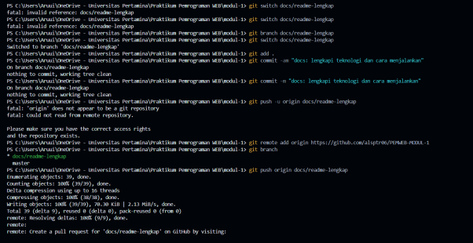

*Gambar 7: Perintah pembuatan *branch* fitur dan *push* ke GitHub.*

Di GitHub muncul notifikasi *"docs/readme-lengkap had recent pushes"* dengan kondisi *"This branch is 6 commits ahead of and 1 commit behind main"*, lalu dibuka melalui tombol **Compare & pull request**.


*Gambar 8: Tampilan repositori GitHub pada *branch* `docs/readme-lengkap`.*

Pull Request `docs: lengkapi README.md` ditinjau melalui tab **Files changed** sebelum digabungkan dengan **Merge pull request**, kemudian *branch* sumber dihapus sesuai anjuran GitHub.

**Tautan Pull Request yang telah digabungkan:**
https://github.com/alsptr06/PEMWEB-MODUL-1/pull/1

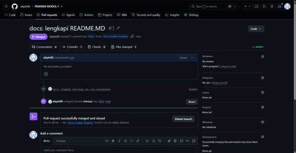

*Gambar 9: Status akhir Pull Request: **Merged**.*

> Catatan: tanda tangan pada halaman judul laporan PDF asli tidak disalin ke dokumen teknis ini.

---

## 3. Pengamatan Lalu Lintas HTTP

### 3.1 Lembar Kerja Pengamatan (Tabel 9)

Pengamatan dilakukan di Chrome DevTools (F12) → tab **Network** dengan opsi **Disable cache aktif** agar setiap permintaan benar-benar diarahkan ke server, lalu diakses `http://localhost:3000/` pada aplikasi *Scientific Calculator* (Next.js App Router + React State + Tailwind CSS).

| No | Nama / URL | Method | Status | Tipe | Ukuran | Waktu | Keterangan |
|:--:|:---|:--:|:--:|:---|:---|:---|:---|
| 1 | `http://localhost:3000/` | GET | 200 OK | document | ± 6,8 kB | ± 916 ms | Dokumen utama HTML; `Content-Type: text/html; charset=utf-8` |
| 2 | `_next/static/css/…` | GET | 200 | stylesheet | ± 15 kB | ± 2 ms | CSS Tailwind hasil kompilasi |
| 3 | `_next/static/chunks/…` (main, app, framework) | GET | 200 | script | puluhan–ratusan kB | puluhan–ratusan ms | JavaScript *bundles* Next.js |
| 4 | `…webpack-hmr` | GET | 101 | websocket | — | persistent | *Hot Module Replacement* dev server |
| 5 | `http://localhost:3000/halaman-tidak-ada` | GET | **404 Not Found** | document | — | — | Rute tak terdefinisi → halaman bawaan Next.js |
| 6 | `http://localhost:3000/` (muat ulang, cache aktif) | GET | **304 Not Modified** | document | ± 0 B | < 5 ms | Server menyatakan konten tak berubah; peramban memakai salinan lokal |

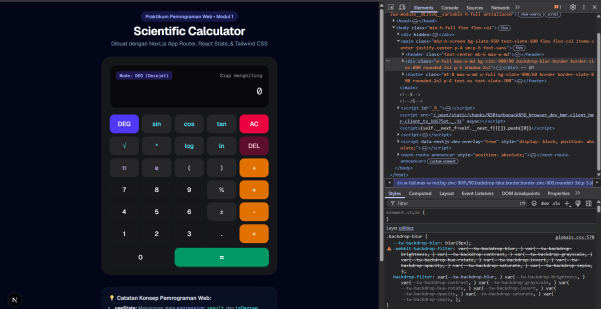

*Gambar 10: Aplikasi Scientific Calculator dan pemeriksaan elemen pada tab Elements.*

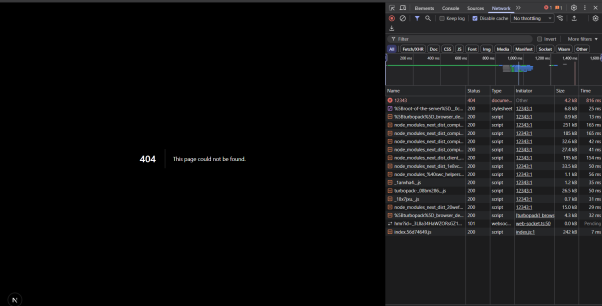

*Gambar 11: Halaman 404 beserta daftar permintaan dan kode statusnya di tab Network.*

### 3.2 Keluaran curl -I dan curl -v

```powershell
curl.exe -I http://localhost:3000
```

Menghasilkan `HTTP/1.1 200 OK` beserta *header* `Content-Type`, `ETag`, dan `Cache-Control`.

```powershell
curl.exe -I http://github.com
```

Menghasilkan:

```
HTTP/1.1 301 Moved Permanently
Location: https://github.com/
```

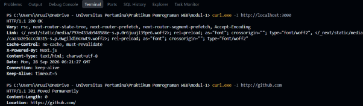

*Gambar 12: Keluaran `curl -I` untuk server lokal (200) dan github.com (301).*

```powershell
curl.exe -v https://example.com
```

Menampilkan secara rinci: resolusi DNS (`172.66.147.243`, `104.20.23.154`), koneksi TCP ke port 443, negosiasi ALPN HTTP/1.1, handshake TLS (schannel), baris permintaan (`GET / HTTP/1.1`, `Host`, `User-Agent: curl/8.21.0`, `Accept: */*`), dan respons `HTTP/1.1 200 OK`.

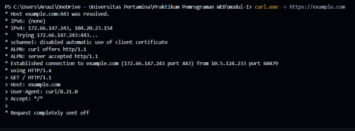

*Gambar 13: Keluaran verbose `curl -v` menunjukkan tahapan DNS → TCP → TLS → HTTP.*

### 3.3 Analisis

**a. Perbedaan status dan ukuran antara pemuatan dengan dan tanpa cache**

Dengan **Disable cache aktif**, setiap muat ulang menghasilkan permintaan penuh dengan status **200** dan ukuran berkas sesungguhnya (misal dokumen utama ± 6,8 kB). Tanpa *disable cache* (kunjungan berikutnya), sebagian besar berkas dimuat dari **disk cache** — kolom *Size* menampilkan label `disk cache` dan waktu tunggu mendekati nol — sedangkan untuk sumber daya yang dapat di-*cache*, server menjawab **304 Not Modified** dengan ukuran respons **0 B**, yang berarti isi tidak dikirim ulang karena tidak berubah sejak versi yang tercatat pada `ETag`/`Last-Modified`. Dampaknya: latensi turun drastis dan beban bandwidth berkurang.

**b. Alasan metode `curl -I` adalah HEAD**

Opsi `-I` (`--head`) menginstruksikan `curl` mengirimkan permintaan dengan metode **HEAD**, bukan GET. Metode HEAD identik dengan GET dalam hal *header* permintaan dan respons, tetapi server **tidak menyertakan isi (*body*) dokumen**. Inilah alasan keluaran hanya menampilkan baris status dan *header* — cocok untuk memeriksa ketersediaan sumber daya, `Content-Type`, atau keberadaan pengalihan tanpa mengunduh konten.

**c. Alasan http://github.com dialihkan**

`http://github.com` dijawab dengan **301 Moved Permanently** beserta *header* `Location: https://github.com/`. GitHub sengaja mengalihkan seluruh lalu lintas HTTP mentah ke HTTPS karena: (1) autentikasi dan isi repositori harus terenkripsi agar tidak terekspos; (2) kode 301 bersifat *permanen* sehingga peramban dan mesin pencari memperbarui referensi ke versi HTTPS; (3) ini merupakan praktik keamanan standar situs besar untuk mencegah serangan *downgrade* dan penyadapan.

---

## 4. Kendala dan Penyelesaian

1. **`git switch main` gagal** (`fatal: invalid reference: main`) — *default branch* lokal bernama `master`, bukan `main`. **Penyelesaian:** memeriksa dengan `git branch`, lalu `git switch master`.
2. **Membuat branch yang sudah ada** (`fatal: a branch named 'master' already exists`) — tidak perlu tindakan; *branch* tersebut memang sudah aktif.
3. **Merge conflict pada `README.md`** saat `git merge latihan/konflik` — **penyelesaian:** menghapus penanda konflik di VS Code melalui *merge editor*, memilih isi akhir, lalu `git add` dan `git commit` *merge commit*.
4. **Peringatan `LF will be replaced by CRLF`** saat `git add` — bersifat informatif karena perbedaan konvensi akhir baris Windows vs Git; Git menormalkannya otomatis tanpa mengubah isi kode.
5. **Dokumentasi tangkapan layar yang terlewat** pada sebagian aktivitas — **penyelesaian:** mensimulasikan ulang aktivitas mandiri di laptop sesuai panduan modul untuk menghasilkan ulang bukti pendukung.
6. **`git commit` dengan pesan berkutip ganda pernah ditolak** karena perbedaan tanda kutip di PowerShell — **penyelesaian:** menyesuaikan format kutipan perintah agar sesuai sintaks PowerShell.

---

## 5. Catatan Pemanfaatan AI

| Aspek | Keterangan |
|:---|:---|
| **Alat** | AI Gemini (fitur chat) |
| **Perintah utama / bagian yang digunakan** | Diskusi perencanaan ulang struktur kegiatan praktikum, konsultasi struktur laporan, serta konsultasi cara membaca pesan *error* Git (misalnya `fatal: invalid reference: main` dan konflik *merge*) |
| **Cara memverifikasi** | Seluruh saran dari AI **tidak langsung ditulis ke laporan**; setiap perintah dijalankan ulang di PowerShell/terminal, hasilnya dibandingkan dengan keluaran aktual (versi Node.js/npm/Git, hasil `git log`, kode status HTTP, dan keluaran `curl`), serta hasil pengamatan DevTools dicek langsung di peramban sebelum dicatat |

> Prinsip yang dipegang: AI digunakan sebagai alat diskusi dan pembenaran arah pengerjaan, sedangkan kebenaran isi laporan tetap berdasarkan hasil praktikum yang benar-benar dijalankan dan diverifikasi mandiri.
